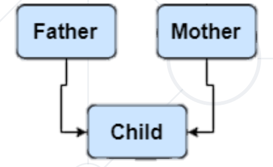
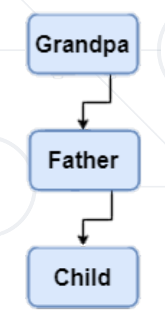
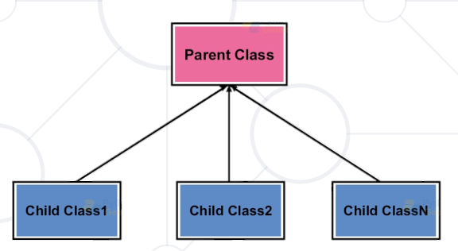

# Inheritance
Capability to Inherit Other Properties

- [Inheritance](#inheritance)
- [Forms of Inheritance](#forms-of-inheritance)
- [Method Resolution Order](#method-resolution-order)
- [Mixins](#mixins)


## Inheritance
The four basic conception of OOP

**Inheritance** - extend the functionality of the code's existing classes to eliminate repetitive code

**Encapsulation** - stop object from interacting with each other so classes cannot change or interact with the specific
variables and functions of an object

**Abstraction** - isolate the impact of changes made to the code so the change will only affect the variables shown and
not the outside code

**Polymorphism** - allows different class to have methods with the same name

### Inheritance
- Inheritance is the capability of one class to inherit the methods and properties from another class
- Benefits of inheritance
  - Code **reusability**
  - Add features to a class without modifying it
  - It is **transitive** in nature

```python
class Person:
    def __init__(self, first_name: str, last_name: str):
        self.first_name = first_name
        self.last_name = last_name

    def get_full_name(self) -> str:
        return f'{self.first_name} {self.last_name}'

class Student(Person):
    pass

# An Object of class Student
student = Student("John", "Smith")
print(student.get_full_name())      # John Smith
```
### The `super()` method

- Built-in method which **returns a temporary object** of the superclass
- Allows you to call methods of the **superclass** in your **subclass**
- The primary use case of this is to **extend** the functionality of the inherited methods

```python
class Person
    def __init__(self, name: str, age: int) -> None:
        self.name = name
        self.age = age

    def get_info(self) -> str:
        return f'{self.name} is {self.age} years old.'

class Student(Person):
    def __init__(self, name: str, age: int, student_id: int) -> None:
        super().__init__(name, age)
        self.student_id = student_id

    def get_id(self) -> int:
        return self.student_id

# Create an Object of the supperclass
person = Person("John", 25)
print(person.get_info())    # returns 'John is 25 years old.'

# Create an Object of subclass
student = Student("Leo", 20, 10025464)
print(student.get_id())     # returns 'Leo is 20 years old.'
print(student.get_id())     # returns 10025464
```

## Forms of Inheritance
### There are four types of inheritance
  - Single
  - Multiple
  - Multilevel
  - Hierarchical

**Hybrid Inheritance** - consists of multiple types of inheritance

### Single Inheritance
- When a child class inherits properties from a **single parante** class only
```python
class Parant:
    def say_hi(self) -> str:
        return "Hello!"

class Child(Parant):
    def go_to_school(self) -> str:
        return "I go to school!"

child = Child()
print(child.say_hi())           # Hello!
print(child.go_to_school())     # I go to school!
```
### Miltiple Inheritance
- When a child inherits from **more than one parent** class
- Allow modeling of **complex** relationships



```python
class Father:
    def __init__(self) -> None:
        self.father_name = 'Taylor Evans'

class Mother:
    def __init__(self) -> None:
        self.mother_name = 'Bet Williams'

class Daughter(Father, Mother):
    def __init__(self) -> None:
      Father.__init__(self)
      Mother.__init__(self)
      
    def get_parent_info(self) -> str:
        return f'Father: {self.father_name}, Mother: {self.mother_name}'

child = Daughter()
print(child.get_parent_info())    # Father: Taylor Evans, Mother: Bet Williams
```
### Miltilevel inheritance
- When a child class becomes a parent class for another child class
- In Python, multilevel inheritance can be done at any depth


```python
class Parent:
    def __init__(self, name: str) -> None:
        self.name = name

    def get_name(self) -> str:
        return self.name

class Child(Parent):
    def __init__(self, name: str, age: int) -> None:
        super().__init__(name)
        self.age = age

    def get_age(self) -> int:
        return self.age
    
class GrandChild(Child):
    def __init__(self, name: str, age: int, address: str) -> None:
      super().__init__(name, age)
      self.address = address
      
    def get_address(self) -> str:
        return self.address
    
grand_child = GrandChild("Grand Name", 19, "Address 15-17")
print(grand_child.name)             # Grand Name
print(grand_child.age)              # 19
print(grand_child.address)          # Address 150117

```
### Hierarchical Inheritance
- When more than one child class are created from a single parent class



```python
class Parent:
    def __init__(self, name: str) -> None:
        self.name = name

    def say_hello(self) -> str:
        return f"Hi! I am {self.name}"

class Daughter(Parent):
    def __init__(self, name) -> None:
        super().__init__(name)
    
    def relation(self) -> str:
        return "I am my parent's daughter"

class Son(Parent):
    def __init__(self, name) -> None:
        super().__init__(name)
        
    def relation(self):
        return "I am my parent's son"
```
## Method Resolution Order
### Method Resolution Order - MRO
- It is the order in which methods should be inherited in the presence of multiple inheritance
- Python 3 use the C3 **linearization** algorithm for MRO
- It is possible to see MRO of class using `mro()` method of the class
```python
class Parent:
    pass

class FirstChild(Parent):
    pass

class SecondChild(Parent):
    pass

class GrandChild(SecondChild, FirstChild):
    pass

print(GrandChild.mro())
# [<class '__main__.GrandChild'>, <class '__main__.SecondChild'>, <class '__main__.FirstChild'>, 
# <class '__main__.Parent'>, <class 'object'>]
```
## Mixins
### "mix-in" extra properties and methods
- A `mixin` is a class that is implementing a specific set of features that is needed in **many different classes**
- A mixin is a class which **has no data**, only methods
- Mixins **cannot be instantiated** by themselves
- We use mixins to **extend functionality**
### Mixins Advantages
- Provides **non-complex** mechanisms of **multiple inheritance**
- Provides **code reusability**
- Allow inheritance and use if only **desired features** from the parent class, **not all of them**
```python
class Vehicle:
    def __init__(self, position: int) -> None:
        self.position = position

    def travel(self, destination):
        pass

class RadioMixin:
    def play_song_on_station(self, station_frequency: int) -> str:
        return f'playing song on radio frequency {station_frequency}'

class Car(Vehicle, RadioMixin):
    pass

class Clock(RadioMixin):
    pass

car = Car()
clock = Clock()
print(car.play_song_on_station(95.0))       # playing song on radio frequency 95.0
print(clock.play_song_on_station(100.3))    # playing song on radio frequency 100.3
```
### Summary
- `Inheritance` is the capability to inherit the properties from some another class
- `super()` method allows us to call methods of the superclass in your subclass
- `Mixins`implement a set of features that is needed in many different classes

