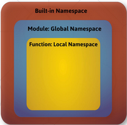

# First Steps in Object-Oriented Programming

- [Project Architecture](#project-architecture)
- [Scope and Namespaces](#scope-and-namespaces)
- [Basic of OOP](#basic-of-oop)
- [Creating and Using Classes](#creating-and-using-classes)

## Project Architecture
Splitting Code into Logical Parts
Use methods to split code into functional blocks
- Improves code **readability**
- Allows for easier **debugging**
- a **single** function should complete a single task

```editorconfig
for move in moves:
    for row in range(len(people)):
        for col in range(len(people[row])):
            if people[row][col] == 'b'
```
better solution:
```editorconfig
for move in moves:
    def move_enemies()
    def person_check()
    def move_player(move)
```

```editorconfig
def rhombus_of_stars(number_of_stars):
    """
    Reads a positive integer and returns the number of rhombus of stars.
    :return: returns the number of rhombus of stars.
    """

    draw_upper_part(number_of_stars)
    draw_bottom_part(number_of_stars)


def draw_upper_part(n):
    """
    Will draw a upper part of rhombus of stars.
    :param n: number of rhombus of stars.
    :return: upper part of rhombus of stars.
    """

    for i in range(1, n + 1):
        draw_row(n, i)

def draw_bottom_part(n):
    """
    Will draw a bottom part of rhombus of stars.
    :param n: number of rhombus of stars.
    :return: bottom part of rhombus of stars.
    """
    for i in range(n , 0, -1):
        draw_row(n, i)


def draw_row(number_of_stars, i):
    """
    This will draw a row of rhombus of stars.
    :param number_of_stars: *
    :param i: looping through the number of stars.
    :return: print(f"{' ' * (n - i)}{'* ' * i}")
    """

    print(f"{' ' * (number_of_stars - i)}{'* ' * i}")

rhombus_of_stars(3)
```
## Scope and Namespaces
### What is Namespaces?
- A mapping from names to objects
- Examples:
  - `Built-in` names, for example, the **abs()** function
  - `Global` names in a **module**
  - `Local` names on a function invocation
- There is no relation between names in different **namespaces**



### What is a Scope?

- A region in a program where a **namespaces** is directly accessible
- In most of the cases there are at least three nested **scopes**:
  - The `innermost` us checked first
  - The scopes of any `enclosing functions`
  - The next-to-last scope (module's `global` names)
  - The outermost (`built-in` names)
```editorconfig
# Local Scope
def scopes():
    def local_scope():
        text = "local text"

# Nonlocal Scope
def nonlocal_scope():
    nonlocal text
    text = "nonlocal text"

# Global Scope
def global_scope():
    global text
    text = "global text"
```

## Basic of OOP
What is an Object-Oriented Programming?
- It is the `most popular` programming paradigm
- It relies on the concept of `classes and objects`
- A `class` is used to create an `individual instance` of an `object`

### Advantages of OOP
- Provides a **clear program structure** and a **clean code**
- **Reduce** complexity
- Make it **easy to write** a reusable code
- Could **test** each behavior of an object **separately**
- Facilitates **easy maintenance** and **modification** of existing code

### Objects in Python
- `Everything` in Python is `an object` and has `a type`
  - 10.5
  - "Python"
  - [1, 2, 3, 4]
  - {"name":"Peter", "age":26}
- We could `create` as many objects as we like, **manipulate** them, or `remove` them

```editorconfig
# create an object of type list
numbers = [1, 2, 3, 4, 8, 10]

# manipulate the object by adding en element
numbers.append(5)
print(numbers) # [1, 2, 3, 4, 8, 10, 5]

remove the object
del numbers
print(numbers) # Error
```
### What is an Object?
- Object is `data abstraction` that captures an `internal representation` and `an interface`
- The internal representation should be `private`
- The interface `defines behaviors` but `hides implementation`

### Characteristics of an Object
- `State`
  - Help to distinguish an object from other objects
  - A phone could have a color, a size, a weight
- `Behavior`
  - The task that an object performs
  - A phone could turn on, turn off
  - 
### What is ac Class?
- The class is a `blueprint that defines the nature` of a future object
- In Python, a class is created by keyword class
```editorconfig
class Phone: # class name
    def __init__(self, color, size):
                     
        # States             
        self.color = color
        self.size = size
    
    # Behavior
    def turn_on(self)
        return 'The phone is turned on'
```
### What is an Instance?
- `Specific realization` of an object of certain class
- The creation of an instances is called `instantiation`
```editorconfig
# Instance
phone = Phone("blue", 4,7)
```
## Creating and Using Classes
```editorconfig
class Book:
    def __init__(self, name:str, author:str, pages:int):
        self.name = name
        self.author = author
        self.pages = pages

book = Book("My Book", "Me", 200)
print(book.name)
print(book.author)
print(book.pages)
```
### Methods
- We define `the behavior` of the object using `methods`
- It is like a function, that works only `within a class`
```editorconfig
class Animal:
  def __init__(self, name):
    self.name = name
                   
    # Defining a Method               
    def sleep(self):
        return "sleeping.."

animal = Animal("cat")
print(animal.sleep()) # sleeping..
```
- Using a class means creating new instances of objects and executing operations on the instances

### Summary
- OOP relies on the concept of classes and objects
- Object is a data abstraction that captures an internal representation and an interface
- Class is a blueprint that defines the nature of a future object
- Instance is a specific realization of any object