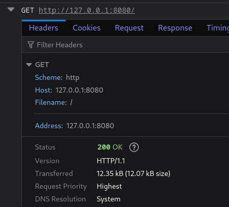
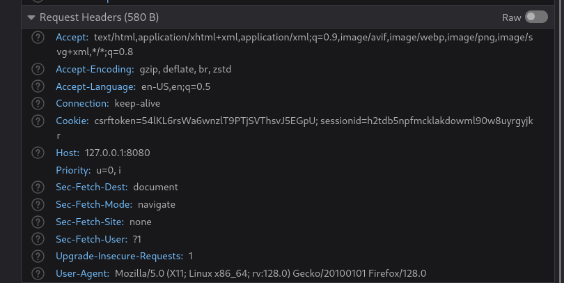
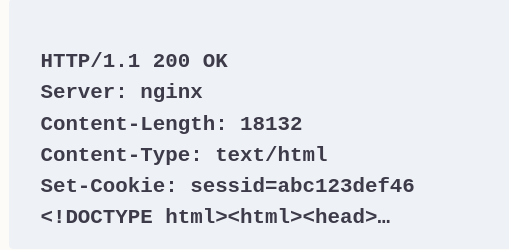
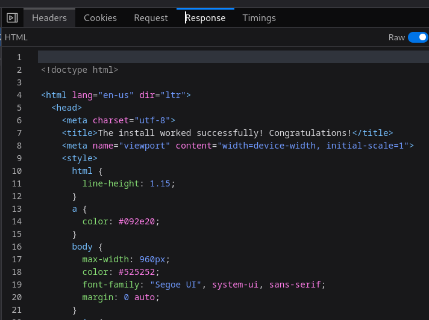

## Web Development with Django

### Django Project 
A Django project is a directory that contains all the data for your project – code, settings, templates, and assets. 
```aiignore
django-admin startproject web_devops_with_django
```
`manage.py` is a Python script that is executed at the command line to interact with your project. 

### Django development server
```aiignore
python manage.py runserver 8080
```
### Create apps - 
```aiignore
python manage.py startapp reviews
```

### There are a number of useful commands that manage.py provides.
- runserver: This starts the Django development HTTP server to serve the Django app on your local computer.
- startapp: This creates a new Django app in your project. We’ll talk about what apps are in more depth soon.
- shell: This starts a Python interpreter with the Django settings pre-loaded. This is useful for interacting with your
application without having to manually load your Django settings.
- dbshell: This starts an interactive shell connected to your database, using the default parameters from your Django 
settings. You can run manual SQL queries this way.
- makemigrations: This generates database change instructions from your model definitions. You will learn what this 
means and how to use this command in Chapter 2, Models and Migrations.
- migrate: This applies migrations generated by the makemigrations command. You will use this in Chapter 2, 
Models and Migrations, as well.
- test: This runs automated tests that you have written. You’ll use this command in Chapter 14, 
Testing Your Django Applications.

### Model-View-Template
A common design pattern in application design is the Model View Controller (MVC), where the model of an application 
(its data) is displayed in one or more views, and a controller marshals interaction between the model and view. 
Django follows a different, yet similar, paradigm called the Model-View-Template (MVT).

Like MVC, MVT also uses models for storing data. However, with MVT, a view will query a model and then render it 
with a template. 

### Models
Django models define data for your application and provide an abstraction layer to a SQL database access through an 
Object Relational Mapper (ORM). An ORM lets you define your data schema (classes, fields, and their relationships) 
using Python code, without needing an understanding of the underlying database.

### Views
A Django view is where most of the logic for your application is defined. When a user visits your site, 
their web browser will send a request to retrieve data from your site. 
A view is a function that you write that will receive this request in the form of a Python object 
(specifically, a Django HttpRequest object). It is up to your view to decide how it should respond to the request and 
what it should send back to the user. Your view must return an HttpResponse object that encapsulates all the information
being provided to the client – content, HTTP status, and other headers.

### Templates
A template is a HyperText Markup Language (HTML) file (usually – any text file can be a template) that contains special 
placeholders that are replaced by variables your application provides. 
For example, your application could render a list of items in either a gallery layout or a table layout. 
Your view would fetch the same models for either one but would be able to render a different HTML file with the 
same information to present the data differently. 


### Request 
The request is made up of four main parts – the method, the path, headers, and the body. Some types of requests 
don’t have a body. If you just visit a web page, your browser will not send a body, whereas if you are submitting a form 
,then your request will have a body containing the data you’re submitting. 

The headers contain extra metadata about the request. Each header is on its own line, with the `header name` and its 
`value` separated by a colon. Most are optional. Header names are not case-sensitive. 


- **Host**: As mentioned, this is the only header that is required (for HTTP 1.1 or later).
It is needed for the web server to know which website or application should respond to the request if there are 
multiple sites hosted on a single server.
- **User-Agent**: Your browser usually sends to the server a string identifying its version and operating system. 
Your server application could use this to serve different pages to different devices
(for example, a mobile-specific page for smartphones).
- **Cookie**: You have probably seen a message when visiting a web page that lets you know that it is storing a cookie
in the browser. These are small pieces of information that a website can store in your browser and use to identify 
you or save settings for when you return to the site. If you were wondering about how your browser sends these cookies
back to the server, it is through this header.



The first line contains the HTTP version, a numeric status code (200) 
and then a text description of what the code means (OK – the request was a success).


- **Server**: This is similar but the opposite of the User-Agent header – this is the server telling the client what software it is running.
- **Content-Length**: The client uses this value to determine how much data to read from the server to get the body.
- **Content-Type**: The server uses this header to indicate to the client what type of data it is sending. The client can then choose how it will display the data – an image must be displayed differently from HTML, for example.
- **Set-Cookie**: We saw in the first request example how a client sends a cookie to the server. This is the corresponding header that a server sends to set that cookie in the browser.




### Introducing Django views
View is simply a function that takes an HttpRequest instance (built by Django) and (optionally) some parameters from 
the URL. It will then perform some operations, such as fetching data from a database. Finally, it returns HttpResponse.

- **method**: A string containing the HTTP method the browser used to request the page, usually GET, but it will be POST 
if a user has submitted a form.
- **GET**: This is a QueryDict class containing the parameters used in the URL query string. This is the part of the 
URL after ?, if it contains one. Note that this attribute is always available even if the request was not GET.
- **POST**: This is another QueryDict containing the parameters sent to the view in a POST request, such as from a 
form submission. Usually, you would use this in conjunction with a Django form.
- **headers**: This is a case-insensitive key dictionary with the HTTP headers from the request. 
For example, you could vary the response with different content for different browsers based on the User-Agent header.
- **path**: This is the path used in the request. Normally, you don’t need to examine this because Django will automatically
parse the path and pass it to the view function as parameters, but it can be useful in some instances.

### URL mapping
This file contains a variable, urlpatterns, which is a list of paths that Django evaluates in turn until it finds a
 match for the URL being requested. The match will either resolve to a `view` function or `another urls.py` file, 
also containing a urlpatterns variable, which will be resolved in the same manner.

### import HttpResponse class
In views.py insert this content
```
from django.http import HttpResponse
def index(request):
    return HttpResponse("Hello, world!")
```
Then, the view function returns an HttpResponse instance with the content we defined (Hello, world!).

### Set up a URL map to the index view
Import your views into the urls.py file by adding this line after the other existing imports:

```aiignore
import reviews.views
```
Add a map to the index view to the urlpatterns list by adding a call to the path function, with an empty string and a 
reference to the index function:
```aiignore
urlpatterns = [
    path('admin/', admin.site.urls),
    path('', reviews.views.index)
]
```

### exploring GET values and QueryDict objects
Open the views.py file in PyCharm. Add a new variable called name, which reads the user’s name from the GET parameters. 
Add this line after the index function definition:
```aiignore
name = request.GET.get("name") or "world"
```
to make some test:
```aiignore
http://127.0.0.1:8080?name=<some_name>
```

**Note**:
You might wonder why we set `name` to the default world by using or, instead of passing '`world`' as the default value to 
get. Consider what happened, when we passed in a blank value for the name parameter. 
If we had passed '`world`' as a default value for `get`, then the `get` function would still have returned an empty string. 
This is because a value is set for `name`; it’s just that it’s blank. Keep this in mind when developing your views, 
as there is a difference between no value being `set` and a `blank` value being set. Depending on your use case, 
you might choose to pass the default to get.