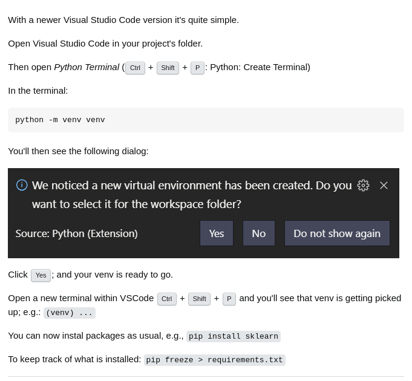

# create virtual enviourment
```
python -m venv .venv
```

# activate .venv
```
source .venv/bin/activate
```

# install flask
```
pip install flask
```

# create app.py 
```
touch app.py
```

....
well done!
