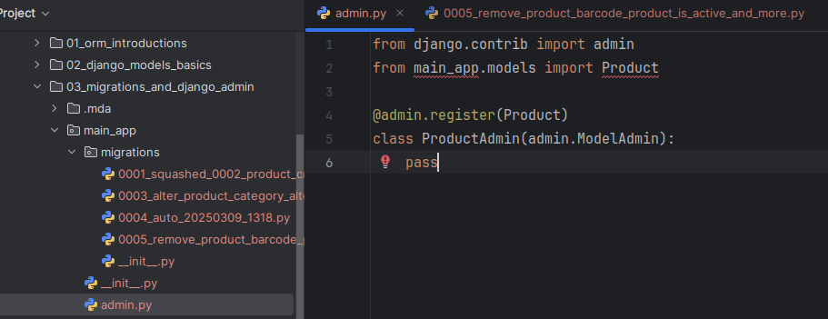
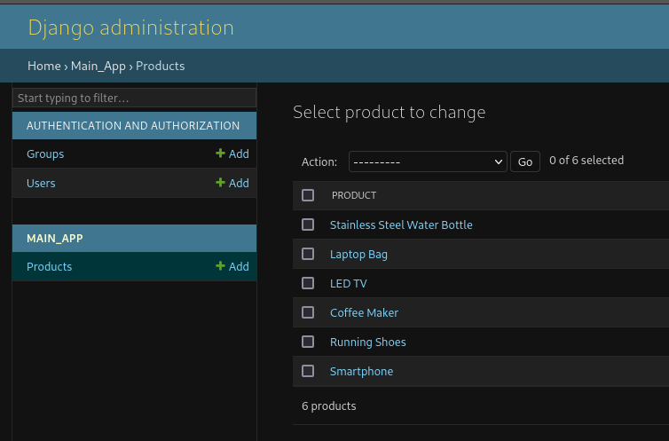

# Django Migrations and Django Admin
- [Django Migrations Advanced](#django-migrations-advanced)
- [Django Admin Site](#django-admin-site])


## Django Migrations Advanced
Django Migrations Basics Overview
- Files with **Python code** that:
    - Propagate changes you make to your models into the database schema
    - Designed to be mostly automatic
Basic Commands
    - **makemigrations** - Packing all changes into migration files
    - **migrate**
      - Applying migrations to the database
      - Unapplying migrations
      
Migration Files
- Python files, written in a **declarative** style
```
from django.db import migrations, models
class Migration(migrations.Migration):
    initial = True
    dependencies = []
    operations = [migrations.CreateModel(
        name='Employee',
        fields=[('id', models.BigAutoField(auto_created=True,
        primary_key=True, serialize=False, verbose_name='ID')),
            ('first_name', models.CharField(max_length=30)),
        ...])]  
```
- It is possible to write them **manually** if needed   

### Applying Migrations
To apply all migrations from all apps
```aiignore
python managy.py migrate
```
To apply all migrations from one apps
```aiignore
python managy.py migrate <main_app>
```
To apply specific migration
```aiignore
python managy.py migrate <main_app> <0001>
```

### Reversing Migrations
To **revert** to a certain migration, pass the app name and the number of the migration you need to revert to
```aiignore
python managy.py migrate <main_app> <0001>
```
To reverse all already applied migrations, use the app name and the name zero as parameters
```aiignore
python manage.py migrate main_app zero
```
- **Note:** If a migration contains any irreversible operations, attempting to reverse it will raise IrreversibleError

### Showing Migrations
Listing project's migrations and their status
```aiignore
python manage.py showmigrations
```
Apps without migrations are also listed but have no migrations printed after them
Listing migrations and their status for a certain app
```aiignore
python manage.py showmigrations main_app
```
### Optimizing Migrations Number and Size
- **squashmigrations** command
  - Reducing an existing set of (many) migrations
    - down to one or sometimes a few migrations
    - still representing the same changes
```aiignore
python manage.py squashmigrations main_app <0023>
```
You need to pass the `app name` and the `migration number/name` all previous migrations will be squashed

### SQL Representation of a Migration
- **sqlmigrate** command
    - Prints the **SQL** for the named migration
    - requires an active database connection
    - must be generated against a copy of the database on which later to be applied on
```aiignore
python manage.py sqlmigrate <main_app> <0001_initial>
```
Need to pass the `app name` and the `migration number/name`

## Custom / Data Migrations
### Data Migrations
- Migrations that **alter data**
- Best written as **separate migrations**
- Sitting **alongside** your *scheme migrations**
- Use **data** migrations to `change`
  - the **data** in the database **itself**
  - in **conjunction** with the scheme if you need that
<hr>

- Django **cannot** automatically generate **Data Migrations**
- It is not very hard to write them **manually**
- Migration files in Django are made up of **Operations**
 - The main **operation** to use for **data migrations** is `RunPython`
<hr>

### Creating an Empty Migration
- By making an **empty** migration file Django will 
    - put the file in the right place
    - suggest a name
    - add **dependencies**
```aiignore
python managy.py makemigrations --empty <main_app>
```
* Need to pass the ** app name**

### RunPython Usage
- Create a function and have **RunPython** use it
- **RunPython** expects a `callable` which takes **two** arguments
  - **apps**
    - A registry of installed application that
      - store configuration
      - provides introspection
      - maintains a list of available models
    - Has the historical version of all models
  - **SchemaEditor**
    - Exposes operations as methods and turns code into SQL
  
## Django Admin Site
It is a **built-in admin interface**
  - Where trust users can manage site content
### Access Django Admin Site
- First, create a **superuser to log in with**
```aiignore
python manage.py createsuperuser
```
### Make the App Modifiable in the Admin
- `Register` all models in a special file in the **app** called **admin.py**
- Use the ModelAdmin class
  - It represent the model in the admin site
```aiignore
from django.contrib import admin
from main_app.models import Product

# create a class that inherits from the ModelAdmin class to register our model:
@admin.register(Product)
class ProductAdmin(admin.ModelAdmin):
    pass
```
OR
```aiignore
from django.contrib import admin
from main_app.models import Product

# to register the model by directly providing the model
# use this when, do not want to define any custom values and we are ok with the default admin interface
admin.site.register(Product)
```
#### Example:


### Django Admin Benefits
- Easily **manage** (create, update, delete) the data stored in database
- The form is **automatically generated** from the models

## Customizing Django Admin Site
- Use the `ModelAdmin` class
  - Use its **options** to customize the admin interface
### Display the Model Objects
-   Use `__str__()` in the Model class to return a human-readable representation of an object in the **admin site** or 
in **console**
```aiignore
from django.db import models


class Product(models.Model):
    name = models.CharField(max_length=500)
    is_active = models.BooleanField(default=True)
    ...
    
    def __str__(self):
        return self.name
```


### Display the model fields
```aiignore
@admin.register(Product)
class ProductAdmin(admin.ModelAdmin):
    list_display = ['job_title', 'first_name', 'email_address']
```
### ModelAdmin Options
- Add filters to the models
```aiignore
@admin.register(Product)
class ProductAdmin(admin.ModelAdmin):
    list_filter = ['job_level']
```
- Add search box with field names that will be searched
```aiignore
@admin.register(Product)
class ProductAdmin(admin.ModelAdmin):
    search_fields = ['email_address']
```
- Make layout changes on "Add" and "Change" pages
```aiignore
@admin.register(Product)
class ProductAdmin(admin.ModelAdmin):
    fields = [('first_name', 'last_name'), 'email_address']
```
- Control the layout of "Add" and "Change" pages
```aiignore
fieldsets = (
('Personal info',
{'fields': (...)}),
('Advanced options',
{'classes': ('collapse',),
'fields': (...),}),
)
)
```
- To include a date-based drill-down navigation by the field created_on, we should use the option **date_hierarchy** 
and set it to **"created_on"** value:
```aiignore
class ProductAdmin(admin.ModelAdmin):
    date_hierarchy = 'created_on'
```

example:
```aiignore
from django.contrib import admin
from main_app.models import Product


@admin.register(Product)
class ProductAdmin(admin.ModelAdmin):
    # Display the fields "name", "category", "price", and "created_on" (in that order) in the admin pane
    list_display = ('name', 'category', 'price', 'created_on')
    # Enable searching for "name", "category", and "supplier" fields
    search_fields = ('name', 'category', 'supplier')
    # Create filters for "category" and "supplier" fields
    list_filter = ['category','supplier']
    # Control the layout of "Add" and "Change" pages by grouping related fields within different sections:
    #  ◦ Group "General Information" with fields "name", "description", "price".
    #  ◦ Group "Categorization" with fields "category" and "supplier".
    fieldsets = (
        ('General Information', {'fields': ('name', 'description', 'price')}),
        ('Categorization', {'fields': ('category', 'supplier')}),
    )

    # Enable date-based drill-down navigation by the "created_on" field.
    date_hierarchy = 'created_on'
```